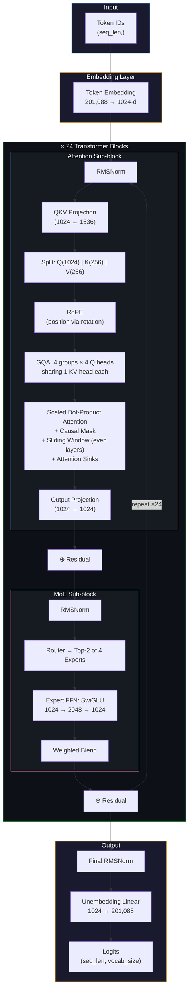

# Nano GPT-OSS — Pre-trained from Scratch

<p align="center">
  
  
  
  
  
</p>

A **truly open-source** implementation of the GPT-OSS architecture, pre-trained entirely from scratch — from raw dataset to tokenization to inference. Not just open weights, but the complete reproducible pipeline with detailed learning comments.

> **Based on:** [VizuaraAI/nano-gpt-oss](https://github.com/VizuaraAILabs/nano-gpt-oss) | [Video Lecture (3hr Deep Dive)](https://www.youtube.com/watch?v=hBUsySdcA3I)

---

## Architecture



<details>
<summary><strong>Architecture at a glance (text version)</strong></summary>

```
Input IDs (seq_len,)
    │
    ▼
┌─────────────────────────────────────────────────────────┐
│  Token Embedding: 201,088 vocab → 1024-d vectors        │
└─────────────────────────────────────────────────────────┘
    │
    ▼
┌─────────────────────────────────────────────────────────┐
│  × 24 Transformer Blocks                                │
│                                                         │
│  ┌───────────────────────────────────────────────────┐  │
│  │  RMSNorm → QKV(1024→1536) → Split Q|K|V          │  │
│  │  → RoPE → GQA (16Q : 4KV) → Attention            │  │
│  │    • Scaled dot-product (1/√64)                   │  │
│  │    • Causal mask (no future tokens)               │  │
│  │    • Sliding window w=128 (even layers)           │  │
│  │    • Attention sinks (16 scalars)                 │  │
│  │  → Output Projection (1024→1024)                  │  │
│  │  → ⊕ Residual                                     │  │
│  └───────────────────────────────────────────────────┘  │
│                         │                               │
│  ┌───────────────────────────────────────────────────┐  │
│  │  RMSNorm → Router (4 experts, pick top-2)         │  │
│  │  → Expert FFN (SwiGLU: 1024 → 2048 → 1024)       │  │
│  │  → Weighted blend → ⊕ Residual                    │  │
│  └───────────────────────────────────────────────────┘  │
└─────────────────────────────────────────────────────────┘
    │
    ▼
┌─────────────────────────────────────────────────────────┐
│  Final RMSNorm → Linear (1024 → 201,088) → Logits      │
└─────────────────────────────────────────────────────────┘
```

</details>

## Table of Contents

- [Architecture](#architecture)
- [What's Different from GPT-2?](#whats-different-from-gpt-2)
- [Results](#results)
- [Complete Architecture Deep Dive](#complete-architecture-deep-dive)
  - [Tokenization (Harmony BPE)](#1-tokenization-harmony-bpe)
  - [Input-Output Pairs](#2-input-output-pairs-next-token-prediction)
  - [RMSNorm](#3-rmsnorm-replacing-layernorm)
  - [Rotary Positional Encodings (RoPE)](#4-rotary-positional-encodings-rope)
  - [Grouped Query Attention (GQA)](#5-grouped-query-attention-gqa)
  - [Sliding Window Attention](#6-sliding-window-attention)
  - [Attention Sinks](#7-attention-sinks)
  - [SwiGLU Activation](#8-swiglu-activation)
  - [Mixture of Experts (MoE)](#9-mixture-of-experts-moe)
- [Training Pipeline](#training-pipeline)
- [Inference & Sampling](#inference--sampling)
- [Project Structure](#project-structure)
- [Quick Start](#quick-start)
- [Training Configuration](#training-configuration)
- [Weights](#weights)
- [References](#references)

---

## What's Different from GPT-2?

This implementation includes **7 major architectural innovations** that make GPT-OSS significantly better than GPT-2 at the same parameter count:

| Innovation | GPT-2 | GPT-OSS | Why It Matters |
|-----------|--------|---------|----------------|
| **Normalization** | LayerNorm | RMSNorm | ~15% faster, skips mean computation |
| **Position Encoding** | Absolute (additive) | RoPE (rotation) | No semantic pollution, relative position awareness |
| **Attention** | Multi-Head (MHA) | Grouped Query (GQA 4:1) | 4× smaller KV cache, faster inference |
| **Attention Window** | Full causal only | Alternating full + sliding (w=128) | ~1000× fewer ops for long sequences |
| **Attention Noise** | None | Learnable attention sinks | Absorbs noisy attention in deeper layers |
| **Activation** | GELU | SwiGLU | Better gradients, gated information flow |
| **Feed-Forward** | Single FFN (4× expand) | Mixture of Experts (MoE) | More capacity, fewer active params per token |

---

## Results

### Loss Comparison (GPT-OSS vs GPT-2, ~500M params)

| Configuration | GPT-OSS Val Loss | GPT-2 Val Loss | Improvement |
|--------------|:---:|:---:|:---:|
| 6 transformer blocks | **1.78** | 2.33 | 23.6% |
| 8 transformer blocks | **1.73** | 2.17 | 20.3% |
| 12 transformer blocks | **1.68** | 2.75 | 38.9% |

### Efficiency

| Metric | GPT-OSS | GPT-2 |
|--------|:---:|:---:|
| Disk Size (FP16) | **2.19 GB** | 2.46 GB |
| RAM (Inference) | **2.60 GB** | 2.94 GB |
| Min GPU Required | **A40** | A100 |
| Training Cost | **~$10** | Higher |

### Sample Outputs

```
Prompt: "A little girl went to the woods"
Output: "A little girl went to the woods alone. She looked around and 
the animals had been playing a game then said I want to tell you a secret..."

Prompt: "Grandmother was telling the kids a story about a unicorn"
Output: "Grandmother was telling kids story about a unicorn who showed 
compassion when one of them heard the man's sad song. It was a charming idea..."
```

---

## Complete Architecture Deep Dive

### High-Level Flow

```
Token IDs (seq,)
  → Embedding (seq, 1024)             : lookup table, each token → dense vector
  → [12× Transformer Blocks]:
      → RMS Norm                       : stabilize activations (no mean, just scale)
      → GQA Attention                  : 16 Q heads share 4 KV heads
          + RoPE (θ=150000)            : position via rotation, not addition
          + Sliding Window (w=128)     : even layers = local, odd = full causal
          + Attention Sinks            : absorb excess attention noise
      → Residual Connection            : x + attention(norm(x))
      → RMS Norm
      → MoE FFN                        : 4 experts, top-2 routing, SwiGLU
      → Residual Connection            : x + moe(norm(x))
  → RMS Norm (final)
  → Unembedding (1024 → 201088)       : project to vocab logits
  → Softmax → Next Token Prediction
```

---

### 1. Tokenization (Harmony BPE)

**Problem:** How do we convert text → numbers that a neural network can process?

**Evolution of approaches:**

| Method | How it works | Problem |
|--------|-------------|---------|
| Word-level | Each word = 1 ID | Massive vocab (500K+), OOV for typos/new words |
| Character-level | Each char = 1 ID | Too long sequences (10× longer), loses word meaning |
| **Subword (BPE)** | Frequent char patterns merge into tokens | Best of both: manageable vocab + handles any input |

**How BPE works (simplified):**
```
Start:  "learning" → ['l', 'e', 'a', 'r', 'n', 'i', 'n', 'g']
Merge 1: 'i'+'n' → 'in'   → ['l', 'e', 'a', 'r', 'n', 'in', 'g']
Merge 2: 'in'+'g' → 'ing' → ['l', 'e', 'a', 'r', 'n', 'ing']
Merge 3: 'learn' ...       → ['learn', 'ing']
Final:   2 tokens instead of 8 characters
```

**Harmony Tokenizer (GPT-OSS specific):**
- Starts from OpenAI's O200K base (200,000 BPE merge rules)
- Adds 1,088 special tokens for chat, tool calls, and reasoning channels
- Final vocabulary: **201,088 tokens**
- Special tokens include: `<|start|>`, `<|end|>`, `<|message|>`, `<|call|>`, `<|channel|>`

**Why O200K over GPT-2's 50K?** Larger vocab = fewer tokens per sentence = shorter sequences = faster training + more context in same window.

---

### 2. Input-Output Pairs (Next-Token Prediction)

**The core training objective:** Given a sequence of tokens, predict the **next** token at every position.

```
Text:    "The cat sat on the mat"
Tokens:  [The, cat, sat, on, the, mat]

Input:   [The, cat, sat, on, the]     ← positions 0-4
Target:  [cat, sat, on, the, mat]     ← positions 1-5 (shifted by 1!)

What the model must learn:
  Given "The"           → predict "cat"
  Given "The cat"       → predict "sat"
  Given "The cat sat"   → predict "on"
  Given "The cat sat on" → predict "the"
```

This is **self-supervised** — no human labels needed. The text IS the label (shifted).

**Why this works:** To predict the next word, the model must understand grammar, semantics, world knowledge, logic, and context. It's a deceptively simple objective that forces general intelligence.

---

### 3. RMSNorm (Replacing LayerNorm)

**Problem:** Deep networks suffer from internal covariate shift — activations at each layer drift during training, making optimization unstable.

**LayerNorm solution (GPT-2):**
```
LayerNorm(x) = (x - mean(x)) / std(x) * γ + β
```
Subtracts mean, divides by std, applies learnable scale (γ) and bias (β).

**RMSNorm solution (GPT-OSS):**
```
RMSNorm(x) = x / RMS(x) * scale
where RMS(x) = sqrt(mean(x²))
```

**Why switch?**
- Skips mean computation → ~15% faster
- Only scale parameter (no bias) → fewer parameters
- Empirically equal or better performance (proven in LLaMA, Gemma, Mistral)
- The mean subtraction in LayerNorm was shown to be unnecessary for convergence

**Key insight:** What matters for gradient flow is that the magnitude is normalized — the centering (mean subtraction) doesn't help much.

---

### 4. Rotary Positional Encodings (RoPE)

**Problem:** Transformers have no inherent sense of token order. "The cat sat" and "sat cat The" produce identical attention patterns without position information.

**GPT-2's solution (additive):**
```python
embedding = token_embedding + position_embedding[0:seq_len]
# Problem: position vector ADDS to semantic meaning
# "king" at position 5 has different magnitude than at position 100
```

**RoPE's solution (multiplicative rotation):**
```
Instead of adding position, ROTATE the Q and K vectors.

For each pair of dimensions (d_2i, d_2i+1):
  Apply 2D rotation by angle θ_i * position

  [cos(θ·pos)  -sin(θ·pos)] [q_1]   [q_1·cos - q_2·sin]
  [sin(θ·pos)   cos(θ·pos)] [q_2] = [q_2·cos + q_1·sin]
```

**Why rotation is better:**
1. **Preserves magnitude:** ||rotated_vector|| = ||original_vector|| (semantic meaning intact)
2. **Relative position naturally emerges:** Q_pos1 · K_pos2 depends only on (pos1 - pos2)
3. **No learned positional embeddings:** Works for any sequence length
4. **Frequency hierarchy:**
   - Low dimensions → high frequency → capture fine word-order
   - High dimensions → low frequency → capture long-range structure

**YaRN (Yet another RoPE extension):**
When you want to use a model beyond its training context length (e.g., trained on 4096 tokens but inference on 32768), YaRN smoothly interpolates/extrapolates the rotation frequencies to maintain coherent attention at extended positions.

---

### 5. Grouped Query Attention (GQA)

**The KV-cache problem:**

During inference, each new token needs to attend to ALL previous tokens. Storing K,V for every head × every position is expensive:

```
Full MHA (GPT-2):   16 heads × seq_len × 64 dim = 16× memory
GQA (GPT-OSS):      4 KV heads × seq_len × 64 dim = 4× memory  (4× cheaper!)
```

**How GQA works:**
```
16 Query heads are grouped into 4 groups of 4:
  Q heads [0,1,2,3]   share KV head 0
  Q heads [4,5,6,7]   share KV head 1
  Q heads [8,9,10,11]  share KV head 2
  Q heads [12,13,14,15] share KV head 3
```

Each query head has its own projection (learns different attention patterns), but the keys and values are shared within each group.

**Trade-off spectrum:**
```
Multi-Head (MHA):    16Q : 16KV = 1:1  → best quality, most memory
Grouped Query (GQA): 16Q : 4KV  = 4:1  → ~same quality, 4× less memory
Multi-Query (MQA):   16Q : 1KV  = 16:1 → slight quality loss, 16× less memory
```

GQA is the sweet spot — negligible quality loss with significant memory savings.

---

### 6. Sliding Window Attention

**Problem:** Full causal attention is O(n²) — every token attends to ALL previous tokens. For seq_len=4096, that's 4096² = 16.7M operations per head.

**Solution:** Limit attention to a local window of w=128 tokens.

```
Full causal (odd layers):   token_1000 attends to tokens [0, 1, ..., 999]
Sliding window (even layers): token_1000 attends to tokens [872, 873, ..., 999]
```

**Why alternating?**
- Sliding layers capture LOCAL patterns (syntax, adjacent word relationships)
- Full layers capture GLOBAL patterns (long-range dependencies, story structure)
- Together: effective receptive field grows exponentially through the stack
- After 6 sliding + 6 full layers: every token has indirect access to the full context

**Computational savings:** Sliding window reduces attention from O(n²) to O(n × w), which for n=4096, w=128 is a 32× reduction in even-layer attention compute.

---

### 7. Attention Sinks

**Problem:** In deep transformer layers, ALL tokens tend to pay high attention to the first few tokens — even when those tokens are semantically irrelevant (like "The" or "Once"). This is called the "attention sink" phenomenon.

**Why it happens:** Softmax must sum to 1.0 across all positions. When a token has no strong preference, it needs somewhere to "dump" its excess attention. The first token becomes a convenient garbage collector.

**Problem with sliding window:** If the first token is outside the window, the excess attention spills onto random tokens within the window, corrupting the signal.

**Solution:** Add a learnable bias column to the attention matrix:

```
Standard:   softmax([Q·K₁, Q·K₂, ..., Q·Kₙ])        → weights sum to 1.0
With sinks: softmax([Q·K₁, Q·K₂, ..., Q·Kₙ, sink]) → weights sum to 1.0

The "sink" absorbs excess probability mass.
After softmax, we DROP the sink column before computing the weighted sum of values.
```

**Effect:** Real attention scores become cleaner because noise is explicitly captured by the sink, not spread across content tokens. One learnable parameter per attention head.

---

### 8. SwiGLU Activation

**Problem:** The activation function between FFN layers determines the network's expressiveness. The evolution:

```
ReLU:    max(0, x)           → Simple but "dead neurons" (gradient = 0 for x < 0)
GELU:    x · Φ(x)           → Smooth, no dead neurons, used in GPT-2
GLU:     σ(xW₁) * xW₂      → Gated: one path controls what the other passes
SwiGLU:  swish(xW₁) * xW₂  → Best of both: smooth gating with learnable sharpness
```

**How SwiGLU works in GPT-OSS:**
```python
# Input is split into two interleaved streams:
gate_path   = input[..., ::2]    # Even indices
linear_path = input[..., 1::2]   # Odd indices

# Gate path: Swish activation (smooth, non-zero gradient everywhere)
gate = gate_path * sigmoid(1.702 * gate_path)

# Output: gate controls how much of (linear + 1) passes through
output = gate * (linear_path + 1)
```

**Why the +1 bias?** Without it, if `linear_path ≈ 0`, the output is always ≈ 0 regardless of the gate. Adding 1 means the gate starts "open" by default and learns to close selectively.

**Why better than GELU?**
- Two paths provide richer representation (more expressiveness per parameter)
- Learned gating → selective feature amplification/suppression
- Better gradient flow through the linear path (always has gradient)
- In GPT-OSS: input dimension × 2 → SwiGLU → input dimension (2.7× fewer params than 4× expand)

---

### 9. Mixture of Experts (MoE)

**Problem:** Scaling a single FFN increases compute linearly with parameters. We want more capacity without proportionally more compute.

**Solution:** Instead of 1 large expert, use N small experts + a router:

```
Standard FFN (GPT-2):
  Every token → one big FFN (hidden × 4 × hidden) → output

MoE (GPT-OSS):
  Every token → Router (which experts are best?) → Top-2 experts → blend outputs

  Router: Linear(1024 → 4) → top-K → softmax → weights
  Expert: Linear(1024 → 2048) → SwiGLU → Linear(1024 → 1024)
```

**Full GPT-OSS 20B configuration:**
- 32 experts total, 4 active per token
- Total parameters: 20B
- Active parameters per token: 3.6B (82% savings!)
- Each expert specializes naturally (verbs, nouns, emotions, story structure, etc.)

**Our Nano configuration:**
- 4 experts total, 2 active per token
- Gives 4× capacity with only 2× compute

**Router mechanics:**
```python
scores = Linear(hidden_state)           # Score each expert (4 scores)
top_k_scores, top_k_indices = topk(scores, k=2)  # Pick best 2
weights = softmax(top_k_scores)         # Normalize to blend weights
output = weights[0] * expert_A(x) + weights[1] * expert_B(x)
```

**Why it works:** Different experts learn to handle different types of tokens/patterns. The router learns which expert is best for each token dynamically. Dormant experts contribute zero compute.

---

## Training Pipeline

### Learning Rate Schedule: Warmup + Cosine Annealing

```
LR
3e-4 ─────────────────╮
                      │  ╲
                      │    ╲  Cosine decay
                      │      ╲
3e-5 ─╱              │        ╲───────
      Warmup          │
      (200 steps)     │  (remaining steps)
```

**Why warmup?** Random weights at start → huge gradients. Starting with low LR prevents catastrophic early updates. Gradually ramp up as the model finds a reasonable region.

**Why cosine decay?** Smoothly reduces LR, allowing the model to make increasingly fine-grained adjustments. The minimum LR (3e-5) prevents complete stagnation.

### Optimizer: AdamW

```
Standard SGD: θ = θ - lr * gradient
Adam:         θ = θ - lr * gradient / (√variance + ε)   ← adaptive per-param LR
AdamW:        θ = θ - lr * gradient / (√variance + ε) - lr * wd * θ  ← decoupled decay
```

**Key settings:**
- β₁=0.9: Momentum for gradient mean (how much history to keep)
- β₂=0.95: Momentum for gradient variance (lower than default 0.999 — adapts faster for LLMs)
- Weight decay=0.1: Prevents overfitting by shrinking weights toward zero
- Gradient clipping=1.0: Caps gradient norm to prevent exploding gradients (important for bf16)

### Training Data Flow

```
2M TinyStories → Join into 1 stream → Tokenize (BPE)
→ Slice into 4096-token windows (stride=4096, no overlap)
→ Each window: input = tokens[0:4096], target = tokens[1:4097]
→ Batch 8 windows → GPU → Forward → Cross-entropy loss → Backward → Update
```

**Cross-entropy loss:** For each position, the model outputs 201,088 logits. Loss = -log(probability assigned to the TRUE next token). Lower = model assigns higher probability to correct answers.

---

## Inference & Sampling

### Auto-regressive Generation

```python
# The model only generates ONE token at a time.
# To generate a sentence, we loop:
tokens = tokenize("Once upon")
for i in range(max_tokens):
    logits = model(tokens)           # Score all 201K vocab tokens
    next_token = sample(logits[-1])  # Pick from last position's prediction
    tokens.append(next_token)        # Grow the sequence
    # Next iteration: model sees the new token too!
```

### Sampling Strategies

**Temperature (controls randomness):**
```
logits = logits / temperature

temp=0.3: [0.9, 0.05, 0.03, 0.02]  → almost always picks "the"
temp=0.8: [0.5, 0.25, 0.15, 0.10]  → usually "the", sometimes "a"
temp=1.5: [0.3, 0.25, 0.23, 0.22]  → nearly uniform — very random
```

**Top-K (hard cutoff):**
```
Keep only the K most probable tokens, zero out the rest.
top_k=50: Consider 50 options, ignore the other 201,038.
Prevents sampling extremely unlikely tokens ("xylophone" after "The cat").
```

**Top-P / Nucleus (adaptive cutoff):**
```
Sort by probability, keep smallest set that sums to ≥ P.

If model is confident: [0.8, 0.1, 0.05, ...] → only 2-3 tokens kept
If model is unsure:    [0.1, 0.09, 0.08, ...] → many tokens kept

Adapts K dynamically based on model confidence!
```

---

## Project Structure

```
nano-gpt-oss/
├── README.md                          # This file
├── requirements.txt                   # Python dependencies
├── .gitignore                         # Git ignore rules
│
├── notebooks/                         # Runnable Jupyter notebooks
│   ├── train.ipynb                    #   Complete training pipeline
│   │                                  #   (self-contained, fully commented)
│   └── inference.ipynb                #   Load weights & generate text
│                                      #   (temperature, top-k, top-p sampling)
│
├── src/                               # Source modules (importable)
│   ├── __init__.py
│   ├── config.py                      #   ModelConfig dataclass
│   └── tokenizer.py                   #   Harmony tokenizer (extends O200K)
│
├── docs/                              # Documentation
│   └── notes/                         #   Architecture study notes
│       ├── README.md                  #     Index of all notes
│       ├── gpt-oss-notes.html         #     Interactive HTML (SVG diagrams)
│       ├── 01-overview-and-data.md    #     Motivation, dataset, tokenization
│       ├── 02-dimensions-guide.md     #     Matrix shapes with full arithmetic
│       ├── 03-normalization-and-embeddings.md
│       ├── 04-attention-mechanisms.md #     GQA, RoPE, Sinks, Sliding Window
│       ├── 05-ffn-and-moe.md          #     SwiGLU, Mixture of Experts
│       ├── 06-training-and-inference.md
│       ├── 07-code-walkthrough.md     #     Full code explanation
│       └── 08-deep-questions.md       #     Architectural Q&A
│
├── assets/                            # Images, diagrams (for README/docs)
│
└── checkpoints/                       # Model weights (gitignored)
    ├── gptoss_best.pt                 #   Best validation loss
    └── gptoss_final.pt                #   Final checkpoint + config
```

---

## Quick Start

### Training

```bash
# Clone this repo
git clone https://github.com/<your-username>/nano-gpt-oss.git
cd nano-gpt-oss

# Install dependencies
pip install -r requirements.txt

# Open and run the training notebook
jupyter notebook notebooks/train.ipynb
```

The training notebook handles everything end-to-end:
1. Downloads TinyStories dataset from HuggingFace
2. Tokenizes with O200K Harmony tokenizer (201K vocab)
3. Creates input-output pairs (next-token prediction, stride=context_len)
4. Builds GPT-OSS model (~500M params) on GPU
5. Trains with AdamW + warmup + cosine annealing
6. Evaluates on validation set every 200 steps
7. Saves best checkpoint + epoch checkpoints
8. Optionally copies weights to Google Drive
9. Generates sample text to show qualitative progress

### Inference

```bash
jupyter notebook notebooks/inference.ipynb
```

Features:
- Load from local checkpoint or Google Drive
- Temperature-based sampling with top-K and top-P
- Side-by-side temperature comparison
- Throughput benchmarking (tokens/sec)

---

## Training Configuration

| Parameter | Value | Why |
|-----------|-------|-----|
| Hidden Size | 1024 | Embedding dimension per token |
| Attention Heads (Q) | 16 | More heads = more attention patterns |
| KV Heads | 4 (GQA ratio 4:1) | 4× memory savings over full MHA |
| Head Dimension | 64 | Hidden/Heads = 1024/16 |
| Transformer Blocks | 12 | Depth for learning complex patterns |
| Experts | 4 (top-2 active) | 4× capacity, 2× compute |
| Context Length | 4096 tokens | Window the model sees at once |
| Sliding Window | 128 | Local attention span (even layers) |
| Batch Size | 8 | Sequences processed in parallel |
| Learning Rate | 3e-4 → 3e-5 | Peak → cosine decay minimum |
| Optimizer | AdamW (β₁=0.9, β₂=0.95) | Fast adaptation for LLMs |
| Weight Decay | 0.1 | Regularization strength |
| Gradient Clipping | 1.0 | Prevents bf16 overflow |
| Warmup Steps | 200 | Safe start from random weights |
| Epochs | 3 | Full passes through dataset |
| Hardware | 1× NVIDIA H100 (80GB) | Handles batch=8, ctx=4096 comfortably |
| Training Time | ~2-3 hours | End-to-end on H100 |
| RoPE θ | 150,000 | Higher than default 10K for longer context |
| Precision | bfloat16 | 2× faster than fp32, sufficient accuracy |

---

## Detailed Notes

Interactive architecture notes with inline SVG diagrams are available in [`notes/gpt-oss-notes.html`](notes/gpt-oss-notes.html). Open in any browser for a complete walkthrough of:

- **Tokenization strategies** — word vs char vs subword with visual examples
- **Every architecture component** — with mathematical formulas and "why" explanations
- **Full code walkthroughs** — annotated source code for each module
- **GPT-2 vs GPT-OSS comparisons** — side-by-side architecture diagrams
- **Training dynamics** — loss curves, learning rate schedules, convergence analysis

These notes are designed to be hosted on GitHub Pages for easy sharing.

---

## Weights

Pre-trained weights will be published on HuggingFace Hub:

```python
# Coming soon
# from huggingface_hub import hf_hub_download
# checkpoint = hf_hub_download(repo_id="<username>/nano-gpt-oss", filename="gptoss_best.pt")
```

---

## How to Use This for Learning

This project is structured as a **learning resource**. Recommended order:

1. **Read this README** — understand the high-level architecture and "why" behind each choice
2. **Open `notes/gpt-oss-notes.html`** — deep dive with diagrams and code annotations
3. **Read `train.ipynb`** — every cell is heavily commented explaining what and why
4. **Run `train.ipynb`** — watch the model learn in real-time (loss decreasing, samples improving)
5. **Read `inference.ipynb`** — understand auto-regressive generation and sampling
6. **Experiment** — change temperature, modify config, try different prompts

**Key questions this project answers:**
- Why did modern LLMs move from LayerNorm to RMSNorm?
- Why is rotary encoding better than absolute positional encoding?
- How does GQA save 4× memory with almost no quality loss?
- What problem do attention sinks solve?
- Why is SwiGLU better than GELU for LLMs?
- How does MoE give more capacity without proportional compute?
- How does the training loop actually work (forward → loss → backward → update)?
- How does auto-regressive text generation work step by step?

---

## References

- [GPT-OSS Architecture (OpenAI)](https://github.com/openai/gpt-oss)
- [TinyStories Paper](https://arxiv.org/abs/2305.07759) — "How small can language models be and still speak coherent English?"
- [VizuaraAI nano-gpt-oss](https://github.com/VizuaraAILabs/nano-gpt-oss) — Original implementation
- [RoPE Paper](https://arxiv.org/abs/2104.09864) — Rotary Position Embedding
- [YaRN Paper](https://arxiv.org/abs/2309.00071) — Yet another RoPE extension (context length extension)
- [Attention Sinks Paper](https://arxiv.org/abs/2309.17453) — Efficient Streaming Language Models with Attention Sinks
- [SwiGLU Paper](https://arxiv.org/abs/2002.05202) — GLU Variants Improve Transformer
- [GQA Paper](https://arxiv.org/abs/2305.13245) — GQA: Training Generalized Multi-Query Transformer Models
- [Mixture of Experts Survey](https://arxiv.org/abs/2209.01667) — A Review of Sparse Expert Models in Deep Learning
- [AdamW Paper](https://arxiv.org/abs/1711.05101) — Decoupled Weight Decay Regularization
- [Cosine Annealing](https://arxiv.org/abs/1608.03983) — SGDR: Stochastic Gradient Descent with Warm Restarts

---

## License

MIT License — see [LICENSE](LICENSE) for details.

---

## Acknowledgements

- **Dr. Raj Dandekar** (Vizuara) for the comprehensive lecture and open-source repositories
- **Naman Dwivedi** and **Aman Murari Singh** for the original implementation
- TinyStories authors for the elegant small-scale dataset
